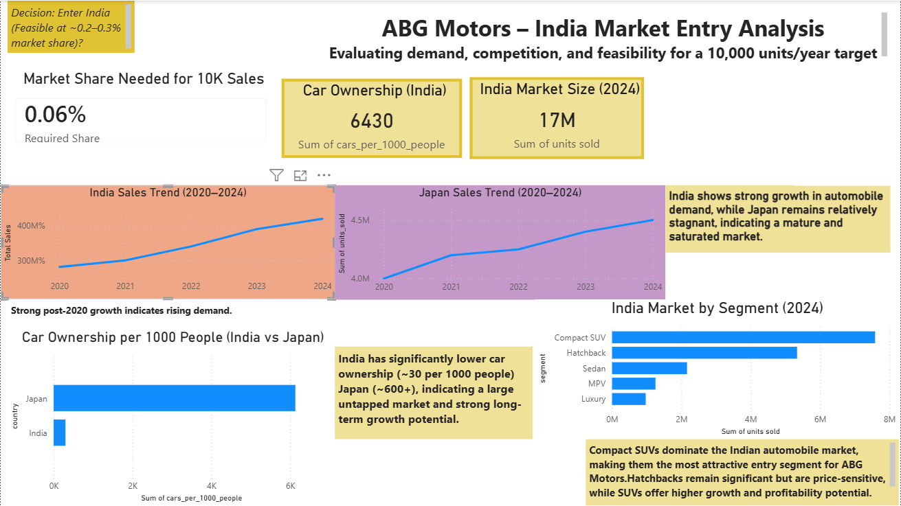

# 🚗 ABG Motors — India Market Entry Analysis

**Can a Japanese automaker enter India's 4.2M unit car market and achieve 10,000 annual sales?**  
A full-stack business intelligence project using PostgreSQL · Excel · Power BI

---

## 📌 Executive Summary

ABG Motors is evaluating entry into the Indian automobile market.

This analysis finds that:
- India is a **high-growth, underpenetrated market**
- The **Compact SUV segment** offers the strongest entry opportunity  
- Only **~0.24% market share** is required to achieve 10,000 annual sales  

**Verdict: Conditional GO** — Entry is feasible with a local manufacturing JV and SUV-focused strategy.

---

## 🚨 Business Problem

| Question | Why It Matters |
|--------|---------------|
| Is India's auto market large enough? | Validates opportunity size |
| Which segment should ABG target? | Determines product-market fit |
| Who are competitors? | Assesses share and pricing pressure |
| Can we hit 10,000 cars/year? | Tests feasibility |
| What’s the entry strategy? | Guides investment decision |

---

## 👤 My Role

- Built end-to-end analysis from raw datasets (Excel → PostgreSQL → Power BI)  
- Designed **market sizing model (TAM/SAM/SOM)**  
- Wrote SQL queries for trend, segment, and competitor analysis  
- Developed interactive dashboard for business decision-making  
- Delivered data-driven market entry recommendation  

---

## 📊 Key Findings & Business Insights

### 1. India shows stronger growth vs Japan
- India car sales show consistent recovery and growth post-2020  
- Japan market remains relatively stable (mature/saturated)

👉 Insight: India offers better expansion potential

---

### 2. Compact SUVs dominate the Indian market
- ~46% market share (~1.9M units in 2024)
- Fastest growing segment in the dataset

👉 Insight: Best entry segment for volume + growth

---

### 3. 10,000 unit target is highly feasible
- Total market size (2024): ~4.2M units  
- Required share: **~0.24%**

👉 Insight: Very low entry barrier for achieving target sales

---

### 4. Competition is strong but not prohibitive
- Top players dominate a large share  
- However, market beyond top brands remains fragmented  

👉 Insight: Entry possible with clear positioning

---

### 5. Structural barrier: Import tariffs
- High import duties (~100% for CBUs) make direct export unviable  

👉 Insight: Local manufacturing (JV/CKD) is essential

---

### 6. Low car ownership indicates untapped demand
- India: ~30 cars per 1000 people  
- Japan: ~600+ cars per 1000 people  

👉 Insight: Significant long-term growth potential

---

## 📈 Market Sizing (TAM → SAM → SOM)

| Level | Definition | Units |
|------|-----------|------|
| TAM | Total India passenger car market | ~4,200,000 |
| SAM | Compact SUV segment (~46%) | ~1,932,000 |
| SOM | Target achievable share (~0.5% of SUV segment) | ~10,000 |

👉 Conclusion: Target sales achievable with minimal share capture

---

## 🏆 Competitive Landscape

| Brand | Market Share | Units (2024) |
|------|-------------|-------------|
| Maruti Suzuki | 41% | 1.7M |
| Hyundai | 15% | 630K |
| Tata Motors | 14% | 588K |
| Mahindra | 10% | 420K |
| Kia | 6% | 252K |

👉 Insight: Market is competitive but allows new entrants in specific segments

---

## 📈 Dashboard



---

## 🛠️ Tools Used

- PostgreSQL → Data querying & analysis  
- Excel → Data cleaning & modeling  
- Power BI → Dashboard & visualization  

---

## 🔍 Sample SQL (Growth Analysis)

```sql
SELECT
    year,
    segment,
    units_sold,
    LAG(units_sold) OVER (PARTITION BY segment ORDER BY year) AS prev_year,
    ROUND(
        (units_sold - LAG(units_sold) OVER (PARTITION BY segment ORDER BY year)) * 100.0
        / NULLIF(LAG(units_sold) OVER (PARTITION BY segment ORDER BY year), 0), 2
    ) AS yoy_growth_pct
FROM india_car_sales;
